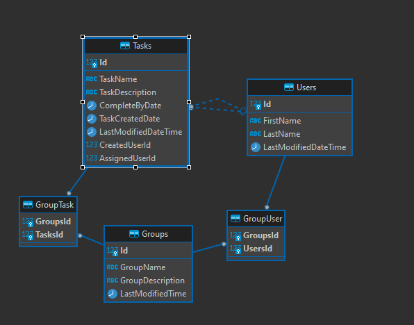

# Homie Core Back End Client
___
- [Overview](#overview)
- [Service Architecture](#service-architecture)
- [Technologies](#technologies)
- [How to Install](#how-to-install)
- [Database Schema](#database-schema)
- [Database Migrations](#database-migrations)
- [API Documentation](#api-documentation)
- [Credits](#credits)
___
# Overview
This project presents a comprehensive CRUD (Create, Read, Update, Delete) REST API, using `ASP.Net v7.0`. The API facilitates the smooth management of `Users`, `Groups`, and `Tasks` - the primary entities in the application.

The `Users` table maintains information about the application users, the `Groups` table holds data about user groups, and the `Tasks` table handles task details that are assigned to the users. The `Tasks` table specifically includes two foreign keys: `CreatedUserId` and `AssignedUserId`, establishing a relationship with the `Users` table.

In addition, two junction tables `GroupTask` and `GroupUser` manage the many-to-many relationships. `GroupTask` associates tasks with specific groups, while `GroupUser` links users with the groups they belong to.

These tables are organized within a PostgreSQL relational database for data management. The API supports complex queries across these tables. During development, I utilized the VS Code Rest Client extension for testing the API endpoints. The .http files used for these tests are included in the Requests folder and serve as example requests to this API.

Before launching the application, set up a database connection and configure your PostgreSQL database. You can find detailed instructions on how to accomplish this in the [Database Migrations](#database-migrations) and [How to Install](#how-to-install) sections. 

A detailed description of the [Database Schema](#database-schema) is provided to explain the database's entity relationships. Detailed documentation for the API, including all HTTP requests, is readily available by running the application in development and navigating to the following URL:
```{host}/swagger```

___
# Service Architecture

- HomieCore.Contracts
    - Group
        - CreateGroupRequest.cs
        - GroupResponse.cs
        - UpsertGroupRequest.cs
    - Task
        - CreateTaskRequest.cs
        - TaskResponse.cs
        - UpsertTaskRequest.cs
    - User
        - CreateUserRequest.cs
        - UserResponse.cs
        - UpsertUserRequest.cs

___

- HomieCore.Data
    - Migrations
        - Migration Files (condensed for length)
    - Models
        - TaskDataSeed.cs
    - Data.cs
    - DataContext.cs
___

- HomieCore
    - Controllers
        - ApiController.cs
        - ErrorsController.cs
        - GroupsController.cs
        - TasksController.cs
    - Models
        - Group.cs
        - Task.cs
        - User.cs
    - ServiceErrors
        - Errors.Group.cs
        - Errors.Task.cs
        - Errors.User.cs
    - Services
        - Groups
            - GroupService.cs
            - IGroupService.cs
            - UpsertedGroupResponse.cs
        - Tasks
            - TaskService.cs
            - ITaskService.cs
            - UpsertedTaskResponse.cs
        - Users
            - UserService.cs
            - IUserService.cs
            - UpsertedUserResponse.cs
    - Program.cs
___

# Technologies
This project utilizes the following technologies: `C#` `ASP.NET v7.0` `ASP.NET Core OpenApi` `ASP.NET Core MVC` `ASP.NET Entity Framework Core` `Npgsql` `PostgreSQL` `dotnet CLI` `Swagger`
___
# How To Install
1. run `git clone https://github.com/MichaelWPicot/homiecore-api`

2. Copy the sample .env file and place it within the ./HomieCore/ folder.

`cp ./HomieCore/.env.sample ./HomieCore/.env `

3. Rename the `TASKSDB_CONNECTION_STRING` in the .env file to a valid Postgres database connection string. _Review .env.sample if you need assistance formatting the connection string._

4. Seed the database and migrate sample data (as needed) by following the migration instructions detailed in the [Database Migrations](#database-migrations) section.

5. Run the following command from the project's root folder to host the API locally:

`dotnet run --project HomieCore/HomieCore.csproj`
___
# Database Schema 
The application database consists of five tables: `Tasks`, `Users`, `Groups`, `GroupTask`, and `GroupUser`.

Refer to the Entity Relationship Diagram below for a visual depiction of this schema:



### Tasks


The `Tasks` table stores tasks that have been designated to users for completion. It encompasses the following attributes:


- `Id`: An integer serving as the task's unique identifier (primary key).
- `TaskName`: A string representing the task's name.
- `TaskDescription`: A string providing a detailed explanation of the task.
- `CompleteByDate`: An ISO 8601 DateTime representing the task deadline.
- `TaskCreatedDate`: An ISO 8601 DateTime representing the time the task was created.
- `LastModifiedDateTime`: An ISO 8601 DateTime reflecting the most recent alteration to the task.
- `CreatedUserId`: A foreign key linking to the Users table, represents the user who created the task.
- `AssignedUserId`: A foreign key linking to the Users table, represents the user assigned to the task.

### Users
The `Users` table contains the application's user data. It contains the following attributes:

- `Id`: An integer serving as the user's unique identifier (primary key).
- `FirstName`: A string containing the user's first name.
- `LastName`: A string containing the user's last name.
- `LastModifiedDateTime`:  An ISO 8601 DateTime that represents the most recent change to the user data.

### Groups
The `Groups` table contains groups which contain users and tasks that are assigned to members of the group. It contains the following attributes:

- `Id`: An integer serving as the group's unique identifier (primary key).
- `GroupName`: A string containing the group's name.
- `GroupDescription`: A string containing the groups's description.
- `LastModifiedTime`:  An ISO 8601 DateTime that represents the most recent change to the group.

### GroupTask
The `GroupTask` table is an associative table that establishes a many-to-many relationship between the `Groups` and `Tasks` tables. It contains the following attributes:

- `GroupsId`: A foreign key that references the `Groups` table.
- `TasksId`: A foreign key that references the `Tasks` table.

_Each record in the `GroupTask` table represents the assigned task that is affiliated with a specific group. For example, a user may belong to many groups and have many tasks assigned to them by each group. The ability to filter tasks by group will aid users in prioritizing their assigned tasks. It also allows for all other group members to see the task is pending completion and is assigned to the user._

### GroupUser
The GroupUser table is an associative table that establishes a many-to-many relationship between the `Groups` and `Users` tables. It contains the following attributes:

- `GroupsId`: A foreign key that references the `Groups` table.
- `UsersId`: A foreign key that references the `Users` table.

_Each record in the `GroupUser` table represents the user's membership in a group._
___
# Database Migrations
All terminal commands related to database migrations should be run inside the HomieCore.Data folder. 

_Note: When dotnet migrations are being generated or applied to HomieCore.Data an additional reference to HomieCore.csproj is included for the database connection and must be included by appending the following to the end of all commands:_ 
```
-s ../HomieCore/HomieCore.csproj
```
To seed the database run the following command:
```
dotnet run seeddata -s ../HomieCore/HomieCore.csproj
```
To add a new migration run the following command:
```
dotnet ef migrations add initialcreation -s ../HomieCore/HomieCore.csproj
```
To update the database to the current migration run the following command:
```
dotnet ef database update -s ../HomieCore/HomieCore.csproj
```
___
# API Documentation
- [User Table](#user-table)
    - [Create User](#create-user)
        - [Create User Request](#create-user-request)
        - [Create User Response](#create-user-response)
    - [Get User](#get-user)
        - [Get User Request](#get-user-request)
        - [Get User Response](#get-user-response)
    - [Update User](#update-user)
        - [Update User Request](#update-user-request)
        - [Update User Response](#update-user-response)
    - [Delete User](#delete-user)
        - [Delete User Request](#delete-user-request)
        - [Delete User Response](#delete-user-response)
- [Group Table](#group-table)
    - [Create Group](#create-user)
        - [Create Group Request](#create-group-request)
        - [Create Group Response](#create-group-response)
    - [Get Group](#get-group)
        - [Get Group Request](#get-group-request)
        - [Get Group Response](#get-group-response)
    - [Update Group](#update-user)
        - [Update Group Request](#update-group-request)
        - [Update Group Response](#update-group-response)
    - [Delete Group](#delete-group)
        - [Delete Group Request](#delete-group-request)
        - [Delete Group Response](#delete-group-response)

___
## User Table

### Create User

##### Create User Request


```js
POST /users
```

```json
{
    "firstName": "John",
    "lastName": "Smith"
}
```

##### Create User Response


```js
201 Created
```


```json
{
    "id": 123414,
    "firstName": "John",
    "lastName": "Smith",
    "lastModifiedDateTime": "2023-06-15T08:00:00"
}
```

___
### Get User


##### Get User Request


```js
GET /users/{{id}}
```

##### Get User Response


```js
200 Ok
```


```json
{
    "id": 123414,
    "firstName": "John",
    "lastName": "Smith",
    "lastModifiedDateTime": "2023-06-15T08:00:00"
}
```
___

### Update User


##### Update User Request


```js
PUT /users/{{id}}
```


```json
{
    "firstName": "John",
    "lastName": "Smith"
}
```

##### Update User Response

```js
204 No Content
```
OR
```js
201 Created
```
___
### Delete User


##### Delete User Request


```js
DELETE /users/{{id}}
```


##### Delete User Response


```js
204 No Content
```
___


## Group Table

### Create Group


##### Create Group Request


```js
POST /groups
```


```json
{
    "groupName": "Night's Watch",
    "groupDescription": "Wasted Potential"
}
```


##### Create Group Response


```js
201 Created
```


```json
{
    "id": 123414,
    "groupName": "Night's Watch",
    "groupDescription": "Wasted Potential",
    "lastModifiedDateTime": "2023-06-15T08:00:00"
}
```
___
### Get Group


##### Get Group Request


```js
GET /groups/{{id}}
```

##### Get Group Response


```js
200 Ok
```


```json
{
    "id": 123414,
    "groupName": "Night's Watch",
    "groupDescription": "Wasted Potential",
    "lastModifiedDateTime": "2023-06-15T08:00:00"
}
```
___

### Update Group


##### Update Group Request


```js
PUT /groups/{{id}}
```


```json
{
    "groupName": "Day's Watch",
    "groupDescription": "Champions of the sun",
}
```

##### Update Group Response


```js
204 No Content
```
OR
```js
201 Created
```
___
### Delete Group

##### Delete Group Request

```js
DELETE /groups/{{id}}
```
##### Delete Group Response

```js
204 No Content
```
___


## Task Table
### Create Task

##### Create Task Request

```js
POST /tasks
```

```json
{
    "taskName": "Clean the Stables",
    "taskDescription": "Replace hay in the pens and fill water troughs",
    "completeByDate":"2023-07-23 02:29:30.638 -0700",
    "createdUserId":1,
    "assignedUserId":2
}
```

##### Create Task Response

```js
201 Created
```

```json
{
    "id": 123414,
    "taskName": "Clean the Stables",
    "taskDescription": "Replace hay in the pens and fill water troughs",
    "completeByDate":"2023-07-23 02:29:30.638 -0700",
    "taskCreatedDate":"2023-07-23 02:29:30.638 -0700",
    "lastModifiedDateTime":"2023-07-23 02:29:30.638 -0700",
    "createdUserId":1,
    "assignedUserId":2
}
```
___
### Get Task

##### Get Task Request

```js
GET /tasks/{{id}}
```

##### Get Task Response

```js
200 Ok
```

```json
{
    "id": 123414,
    "taskName": "Clean the Stables",
    "taskDescription": "Replace hay in the pens and fill water troughs",
    "completeByDate":"2023-07-23 02:29:30.638 -0700",
    "taskCreatedDate":"2023-07-23 02:29:30.638 -0700",
    "lastModifiedDateTime":"2023-07-23 02:29:30.638 -0700",
    "createdUserId":1,
    "assignedUserId":2
}
```
___
### Update Task

##### Update Task Request

```js
PUT /tasks/{{id}}
```

```json
{
    "taskName": "Clean the Tower",
    "taskDescription": "Wash the flagstones and the banners",
    "completeByDate":"2023-07-23 02:29:30.638 -0700",
    "createdUserId":2,
    "assignedUserId":1
}
```

##### Update Task Response

```js
204 No Content
```

or

```js
201 Created
```
___
### Delete Task

##### Delete Task Request

```js
DELETE /tasks/{{id}}
```
##### Delete Task Response

```js
204 No Content
```

___
## Credits
Libraries and extensions used:
- [ErrorOr](https://github.com/amantinband/error-or)
- [dotenv.net](https://github.com/bolorundurowb/dotenv.net)
- [VS Code REST Client](https://github.com/Huachao/vscode-restclient)